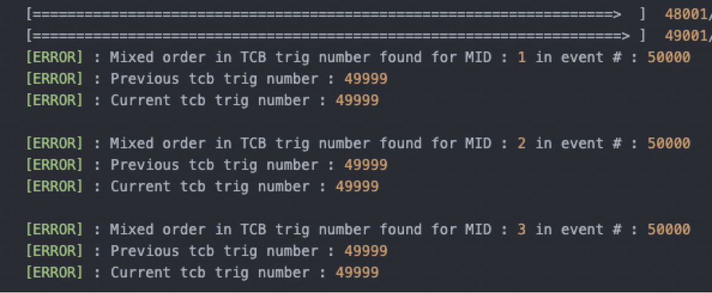
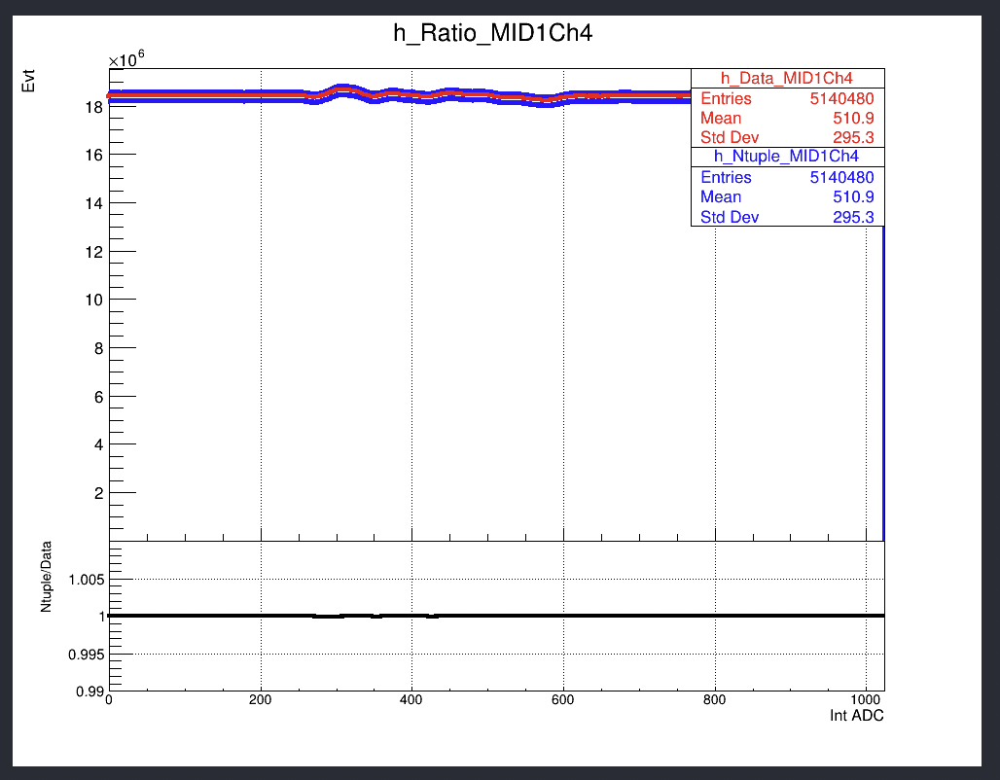
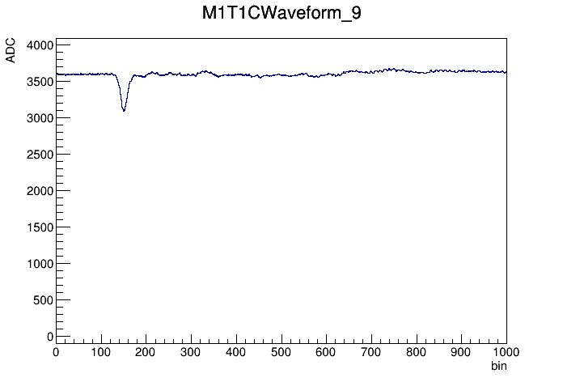
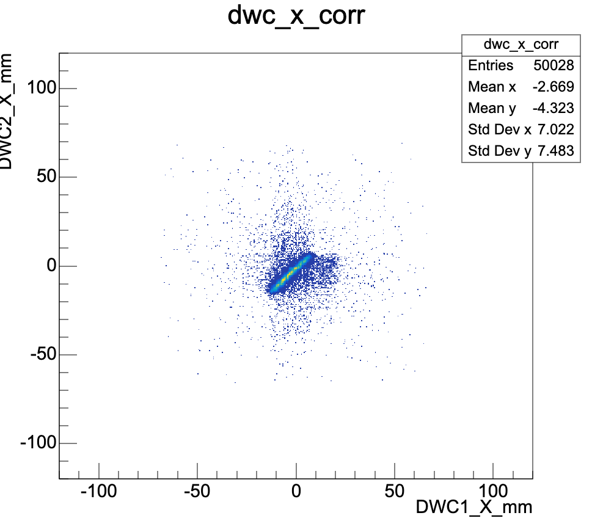
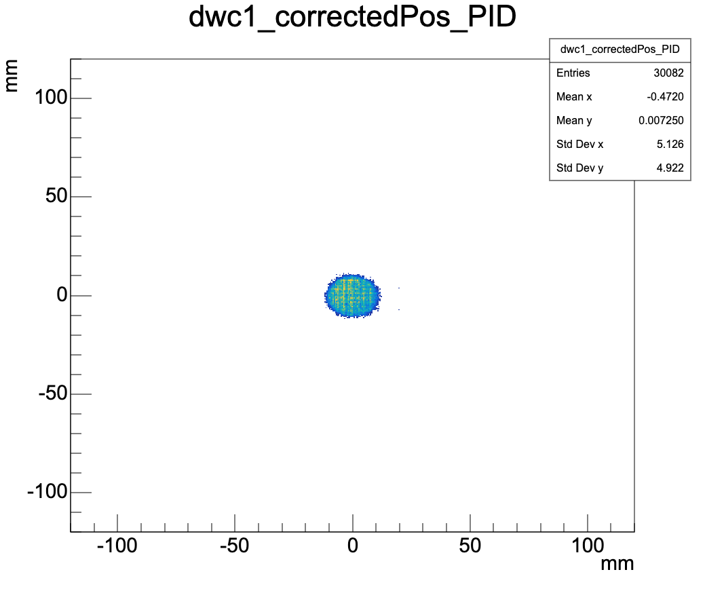

# dual-readout_TB

FWcore for TB data analysis and pre-exercise scripts for [2023 Feb DRC workshop @GWNU](https://indico.cern.ch/event/1238214/timetable/?view=standard)

---
## 1) Dependencies
* ROOT
* python3
* boost::python
>__Note__ All the dependencies can be sourced on KNU / idream server using CVMFS

---
## 2) Installation manual
#### How to compile framework
```sh
# On your working directory, clone preEx_students branch
git clone -b preEx_students

# In dual-readout_TB directory, run installation script
cd dual-readout_TB
source buildNinstall.sh
```

#### How to setup environment
```sh
# Remember to set environment variable everytime you access to server
# In dual-readout_TB directory, run command below
source envset.sh  
```

#### How to compile each analysis script
```sh
# All analysis scripts are available on dual-readout_TB/analysis directory
cd analysis
source compile.sh <analysis code in cpp>

# If you want to compile TBdrawWave.cc script
e.g.) source compile.sh TBdrawWave # This will generate TBdrawWave.exe
```

#### How to run each analysis executable
```sh
./<analysis executable in exe> <run number> <maximum number of events to run>

# If you want to run TBdrawWave to draw waveform of
# 1k events from  Run702 ntuples
e.g.) ./TBdrawWave.exe 702 1000 
```

---
## 3) Pre-exercise
### Suggested runs for pre-exercise

|  Runs   | Energy (GeV) | Particle | Module/Tower | Readout | # of events (wave) | # of events (fast) |
| :-----: | :----------: | :------: | :----------: | :-----: | :----------------: | :----------------: |
| **702** |      20      |    e+    |     M1T1     |   PMT   |     **50028**      |     **49984**      |
| **624** |      20      |    e+    |     M1T2     |   PMT   |     **100046**     |     **100032**     |
| **700** |      20      |    e+    |     M1T3     | MCP-PMT |     **50036**      |     **49984**      |
| **704** |      20      |    e+    |     M1T4     |   PMT   |     **50020**      |     **49984**      |
>__Note__ For more details about run, see the run list documentation and DAQ log in below links.\
[Run list](https://github.com)<!--FIXME-->\
[DAQ log](https://docs.google.com/spreadsheets/d/1Cfoetfduc2Tb8mBhA6O9rtuxci5SGBaZw9uualKWfUA/edit#gid=262558796)

### Pre-exercise instructions

>__Warning__ All instructions are based on Run 702. Students who are not familiar with DRC analysis are recommended to use the same Run 702 data for pre-exercise.

#### 1. Make ntuple from raw data, and validate them

- Ntupler and ntuple validator are available in the `/dual-readout_TB/ntupler` directory
    
- `TBntuplize.py` : Read raw data (.dat format) and create ntuples (.root format)
- `TBvalidator.py` : Read both raw data and ntulple, and compare their contents to make sure everything is well copied to ntuple

- **How to run ntupler**
    ```sh
    # Run after setting environment variables

    # To create waveform ntuples
    python3 TBntupler.py -rn <run number> -o <path to output ntuple files> -fe <number of events to store per file, for waveform mode 5000 is recommended>

    # To create fastmode ntuples
    python3 TBntupler.py -f -rn <run number> -o <path to output ntuple files> -fe <number of events to store per file, for fastmode 100,000 is recommended>
    ```
    For example, to create waveform and fast mode ntuples with Run number 702, run the following command
    ```sh
    # This will create waveform ntuples with 5k events per file in ./ntuple/Run_702/Wave/ directory
    # For waveform mode, -fe 5000 is recommended. 5k waveform event ntuple will have size of ~2 GB per file
    [swkim@idream]$ python3 TBntupler.py -rn 702 -o ./ntuple -fe 5000

    # This will create waveform ntuples with 5k events per file in ./ntuple/Run_702/Fast/ directory
    # For fastmode, -fe 100000 is recommended. 100k fastmode event ntuple will have size of ~200 MB per file
    [swkim@idream]$ python3 TBntupler.py -f -rn 702 -o ./ntuple -fe 100000
    ```

- **How to run validator**
    ```sh
    # Run after setting environment variables

    # To validate waveform ntuples
    python3 TBvalidator.py -rn <run number> -o <path to output valid plots> -in <path to your ntuples>

    # To validate fastmode ntuples
    python3 TBvalidator.py -f -rn <run number> -o <path to output valid plots> -in <path to your ntuples>
    ```
    For example, after creating waveform & fastmode ntuples in `./ntuple/` directory, validate them with following command
    ```sh
    # This will read waveform ntuples from `./ntuple/Run_702/Wave/` directory,
    # and store validation plots in `./valid_plots_Run_702/Wave/` if there're any error
    [swkim@idream]$ python3 TBvalidator.py -rn 702 -o ./ -in ./ntuple/

    # This will read fastmode ntuples from `./ntuple/Run_702/Fast/` directory,
    # and store validation plots in `./valid_plots_Run_702/Fast/` if there're any error
    [swkim@idream]$ python3 TBvalidator.py -f -rn 702 -o ./ -in ./ntuple/
    ```

- If ntuples are well created, no plots will be generated
- If there're any problem with trigger number (event order mixed, missing events etc...), [ERROR] or [WARNING] message will be generated
    
- If the contents in ntuples are not properly stored, ratio plot of ntuple and data contents will be created in `./valid_plots_Run_*/Wave/` for `./valid_plots_Run_*/Fast/` directory
    
>__Warning__ If any error is generated, please check your ntuples before proceeding to next exercise

#### 2. Draw single channel waveform from ntuples
- Before starting this exercise
  1. Please fix `/dual-readout_TB/analysis/functionc.cc` file path
    ```cpp
    // In functions.cc Line 26

    // Change "filePath" to your ntuple file path
    // Default value is :
    std::string filePath = "/gatbawi/dream/ntuple/waveform/Run_"  + std::to_string(runNumber) + "/" + fileName;

    // For example, if your waveform ntuples are created in /u/user/swkim/dual-readout_TB/ntuples/waveform/
    std::string filePath = "/u/user/swkim/dual-readout_TB/ntuples/waveform/Run_"  + std::to_string(runNumber) + "/" + fileName;
    ```
  2. Please create `waveform/` , `waveform/PS/`, `waveform/C/`, `waveform/S/` directories in `/dual-readout_TB/analysis/`
    ```sh
    # In /dual-readout_TB/analysis/ directory
    mkdir waveform
    cd waveform
    mkdir PS C S 
    ```

- In this exercise, students will learn
    - How to read waveform data from ntuples
    - How to get waveform std::vector from waveform data
    - How to draw single channel waveform from waveform vector

- In this exercise, we'll use `TBdrawWave.cc` script in `/dual-readout_TB/analysis`

- Detailed instructions are available in `TBdrawWave.cc` script itself

- After filling all your answers in `TBdrawWave.cc`, compile it and run it to save waveform plots
    ```sh
    # For example, after finishing exercises in TBdrawWave.cc, to draw 100 waveform plots from Run702 ntuple
    bash compile.sh TBdrawWave.cc
    ./TBdrawWave.exe 702 100
    ```
- This will create waveform plots like below in `/dual-readout_TB/analysis/waveform/C/` directory
    
    Pre-shower detector and Module scintillation channel waveform plots will also be saved in `/dual-readout_TB/analysis/waveform/PS` and `/dual-readout_TB/analysis/waveform/S/` directories

#### 3. Draw DWC position plot using waveform ntuples
- Before starting this exercise
  1. Please check the plots created in exercise 1 if their appropriate or not
  2. Please create `dwc/` directory in `/dual-readout_TB/analysis/`
    ```sh
    # In dual-readout_TB/analysis/ directory, create dwc
    mkdir dwc
    ```
  3. Please read [DWC manual ch 1 ~ 4](https://twiki.cern.ch/twiki/pub/DREAM/DwcCalibration/DWC_calibration.pdf) for better understanding

- In this exercise, students will learn
    - How to get peak timing from waveform
    - How to draw DWC position plot using peak timing of waveform
    - How to draw DWC 1 & 2 correlation plot

- In this exercise, we'll use `TBdwc.cc` script in `/dual-readout_TB/analysis`

- Detailed instructions are available in `TBdwc.cc` script itself and [in this pdf](https://twiki.cern.ch/twiki/pub/DREAM/DwcCalibration/DWC_calibration.pdf)

- After filling all your answers in `TBdwc.cc`, compile it and run it to save DWC plots
    ```sh
    # For example, after finishing exercises in TBdwc.cc, to draw DWC plots from Run702 ntuple
    bash compile.sh TBdwc.cc
    ./TBdwc.exe 702 -1
    ```
- This will create DWC 1 & 2 position & correlation plots and store them in root file at `/dual-readout_TB/analysis/dwc/` directory
    
- Created DWC root file will contain DWC 1 & 2 position plot and correlation plots like the following
    |             DWC 1 position              |        DWC X correlation        |
    | :-------------------------------------: | :-----------------------------: |
    |  |  |

#### 4. Draw average time structure of pre-shower detector and module PMT 
- Before starting this exercise
  1. Please make sure DWC root file is created in `/dual-readout_TB/analysis/dwc/` directory
  2. Please create `avgTimeStructure/` directory in `/dual-readout_TB/analysis/`
    ```sh
    # In dual-readout_TB/analysis/ directory, create avgTimeStructure
    mkdir avgTimeStructure
    ```

- In this exercise, students will learn
    - How to give DWC correlation cut
    - How to draw average time structure of pre-shower detector and module PMT
    - How to determine integration range from average time structure

- In this exercise, we'll use `TBavgTimeStructure.cc` script in `/dual-readout_TB/analysis`

- Detailed instructions are available in `TBavgTimeStructure.cc` script itself

- After filling all your answers in `TBavgTimeStructure.cc`, compile it and run it to save average time structure root file
    ```sh
    # For example, after finishing exercises in TBavgTimeStructure.cc, to draw average time structures from Run702 ntuple
    bash compile.sh TBavgTimeStructure.cc
    ./TBavgTimeStructure.exe 702 -1
    ```
- This will create average time structure plots and store them in root file at `/dual-readout_TB/analysis/avgTimeStructure/` directory
    
- Created avgTimeStructure root file will contain average time structure of pre-shower and module PMT (C, S channels) like the following
    |    PS avg time structure    |     M1T1S avg time structure      |
    | :-------------------------: | :-------------------------------: |
    |  |  |

    One can decide the integration range of each plot with this average time structure plots : 
    Set range to cover peak position & peak waveform structure

- DWC 1 position plot before / after correlation cut (1.5 mm threshold) is also stored in same root file
    |     DWC1 position before cut     |         DWC1 position after cut          |
    | :------------------------------: | :--------------------------------------: |
    |  |  |
    
    One can see that events that are far from DWC 1 centers are almost all excluded by applying correlation cut

#### 5. Draw integrated ADC plot of pre-shower detector, and decide PID cut

#### 6. Draw integrated ADC plot of module PMT

---
## 4) Running on batch scheduler (HTcondor)
```shell
[swkim@idream]$ # Sample script for running TBdrawWave.exe is in dual-readout_TB/condor_script/
[swkim@idream]$ cd condor_script
[swkim@idream]$ ls
exe_condor.sh  sub_condor.sub
```
#### 1. Write HTcondor submission script : sub_condor.sub
Sample submission script to run `TBdrawWave.exe` on batch scheduler
This script will run `exe_condor.sh $(Run_number)`, where `$(Run_number)` is line read from the `run_list_m1.txt` file
```sh
# sub_condor.sub
universe = vanilla
executable = exe_condor.sh # This submission script will execute exe_condor.sh script. Change to your own executable script.

arguments = $(Run_number) # Use run number as 1st argument to be passed to exe_condor.sh

# Fix here to locate logs in appropriate directory
output = ./drawWave_log/out/o_$(Run_number).out # output log file location
error  = ./drawWave_log/err/e_$(Run_number).err # error  log file location
log    = ./drawWave_log/log/l_$(Run_number).log # condor log file location

request_memory = 1 GB # 1 GB will be enough for most of jobs

should_transfer_files = YES
when_to_transfer_output = ON_EXIT
# Fix here to properly locate & transfer your executable to be executed by exe_condor.sh, lib64 folder and exe_condor.sh script
transfer_input_files = /u/user/swkim/pre-exercise/dual-readout_TB/analysis/TBdrawWave.exe, \
                       /u/user/swkim/pre-exercise/dual-readout_TB/install/lib64, \
                       /u/user/swkim/pre-exercise/dual-readout_TB/exe_condor.sh

JobBatchName = draw_wave_m1 # Job name
queue Run_number from run_list_m1.txt # Read run_list_m1.txt line by line, and use them as $(Run_number)
# Note that run_list_m1.txt should be in the same directory as your condor submission script
```
#### 2. Write HTcondor execution script : exe_condor.sh
The `sub_condor.sub` script will run `exe_condor.sh`
`exe_condor.sh` will set environment variables on HTcondor, and run `TBdrawWave.exe`
```sh
# exe_condor.sh
#! /bin/bash

source /cvmfs/sft.cern.ch/lcg/views/LCG_102/x86_64-centos7-gcc11-opt/setup.sh

export LD_PRELOAD="/usr/lib64/libpdcap.so"
export LD_LIBRARY_PATH="$LD_LIBRARY_PATH:/usr/lib64/dcap"

# Fix here to your own installation directory!!
export INSTALL_DIR_PATH=/u/user/swkim/pre-exercise/dual-readout_TB/install # FIX!!

export LD_LIBRARY_PATH=$LD_LIBRARY_PATH:$INSTALL_DIR_PATH/lib64
export PYTHONPATH=$PYTHONPATH:$INSTALL_DIR_PATH/lib64

# This script will run TBdrawWave.exe with arguments $1, 100
# $1 : First argument passed to exe_condor.sh by sub_condor.sub. In this case, it is $(Run_number)
# 100 : Maximum number of events to process
# Change TBdrawWave.exe to any other executable to run on batch
./TBdrawWave.exe $1 100
```

#### 3. Submit condor batch jobs using condor_submit
```sh
# In directory with sub_condor.sub, exe_condor.sh, run_list_m1.txt and proper log files
condor_submit sub_condor.sub

# Using condor_q, one can check their batch job status
condor_q
```

>__Note__ For more information about running HTcondor, please refer to [this manual](http://t2-cms.knu.ac.kr/wiki/index.php/HTCondor)

>__Note__ Data stored in KNU Tier-3 Storage Element can also be browsed on batch jobs using dcap protocal. For more information about dcap, please refer to [this manual](http://t2-cms.knu.ac.kr/wiki/index.php/Dcap)

---
## 5) Troubleshooting
#### g++ error while compiling anaylsis scripts 

- Make sure that you set environment variable everytime you access to the server
- Also, source envset.sh should be done on dual-readout_TB directory
```shell
[swkim@idream]$ pwd # Make sure you're in dual-readout_TB directory
/u/user/swkim/dual-readout_TB/
[swkim@idream]$ source envset.sh
```

#### Library error while running executable (same solution as above)


- Make sure that you set environment variable everytime you access to the server
- Also, source envset.sh should be done on dual-readout_TB directory
```shell
[swkim@idream]$ pwd # Make sure you're in dual-readout_TB directory
/u/user/swkim/dual-readout_TB/
[swkim@idream]$ source envset.sh
```

#### Environment setup

```sh
export LD_LIBRARY_PATH=$LD_LIBRARY_PATH:<path_to_install>/lib64 # or lib based on your architecture
export PYTHONPATH=$PYTHONPATH:<path_to_install>/lib64 # or lib based on your architecture
```

---
## 6) Useful links
[2023 DRC workshop @GWNU indico](https://indico.cern.ch/event/1238214/timetable/?view=standard)\
[2022 TB @ CERN main documentation page](https://docs.google.com/document/d/13-dYgLaBQg3d9drPBWCKbW1INf3dPyZcV-TeA5QGHj0/edit#)\
[Run list](https://github.com)<!--FIXME-->\
[DAQ log](https://docs.google.com/spreadsheets/d/1Cfoetfduc2Tb8mBhA6O9rtuxci5SGBaZw9uualKWfUA/edit#gid=262558796)\
[Mapping info](https://docs.google.com/spreadsheets/d/1ZFLbl-4OOqhWQlKlCitL4Pl__JsoVFMME0hQWy3N-M8/edit#gid=257337700)\
[DWC info](https://twiki.cern.ch/twiki/pub/DREAM/DwcCalibration/DWC_calibration.pdf)\
[KNU Tier-3 HTcondor manual](http://t2-cms.knu.ac.kr/wiki/index.php/HTCondor)\
[Using dcap](http://t2-cms.knu.ac.kr/wiki/index.php/Dcap)