# dual-readout_TB

FWcore for TB data analysis and pre-exercise scripts for [2023 Feb DRC workshop @GWNU](https://indico.cern.ch/event/1238214/timetable/?view=standard)\
For any questions / feedback, please contact : sungwon.kim@cern.ch or join our group chat (link announced via KFC mail)

---
- [dual-readout\_TB](#dual-readout_tb)
  - [1) Dependencies](#1-dependencies)
  - [2) Installation manual](#2-installation-manual)
      - [How to access to the server](#how-to-access-to-the-server)
      - [How to compile framework](#how-to-compile-framework)
      - [How to setup environment](#how-to-setup-environment)
      - [How to compile each analysis script](#how-to-compile-each-analysis-script)
      - [How to run each analysis executable](#how-to-run-each-analysis-executable)
  - [3) Pre-exercise](#3-pre-exercise)
    - [Suggested runs for pre-exercise](#suggested-runs-for-pre-exercise)
    - [Data paths in iDream server](#data-paths-in-idream-server)
    - [Pre-exercise instructions](#pre-exercise-instructions)
      - [1. Make ntuple from raw data, and validate them](#1-make-ntuple-from-raw-data-and-validate-them)
      - [2. Draw single channel waveform from ntuples](#2-draw-single-channel-waveform-from-ntuples)
      - [3. Draw DWC position plot using waveform ntuples](#3-draw-dwc-position-plot-using-waveform-ntuples)
      - [4. Draw average time structure of pre-shower detector and module PMT](#4-draw-average-time-structure-of-pre-shower-detector-and-module-pmt)
      - [5. Draw integrated ADC plot of pre-shower detector, and decide PID cut](#5-draw-integrated-adc-plot-of-pre-shower-detector-and-decide-pid-cut)
      - [6. Draw integrated ADC plot of module PMT](#6-draw-integrated-adc-plot-of-module-pmt)
  - [4) Running on batch scheduler (HTcondor)](#4-running-on-batch-scheduler-htcondor)
      - [1. Write HTcondor submission script : sub\_condor.sub](#1-write-htcondor-submission-script--sub_condorsub)
      - [2. Write HTcondor execution script : exe\_condor.sh](#2-write-htcondor-execution-script--exe_condorsh)
      - [3. Submit condor batch jobs using condor\_submit](#3-submit-condor-batch-jobs-using-condor_submit)
  - [5) Troubleshooting](#5-troubleshooting)
      - [Exercise script compile error](#exercise-script-compile-error)
      - [g++ error while compiling anaylsis scripts](#g-error-while-compiling-anaylsis-scripts)
      - [Library error while running executable (same solution as above)](#library-error-while-running-executable-same-solution-as-above)
      - [Environment setup](#environment-setup)
  - [6) Useful links](#6-useful-links)

--- 
## 1) Dependencies
* ROOT
* python3
* boost::python
>__Note__ All the dependencies can be sourced on KNU / idream server using CVMFS

---
## 2) Installation manual
#### How to access to the server
```sh
# All the exercise codes are expected to be compiled & executed on iDream server
# If you don't know your account/password, please contact sungwon.kim@cern.ch
ssh <username>@idream.knu.ac.kr
# enter password
```

#### How to compile framework
```sh
# On your working directory, clone preEx_students branch
git clone -b preEx_students https://github.com/swkim95/dual-readout_TB.git

# In dual-readout_TB directory, run installation script
cd dual-readout_TB
source buildNinstall.sh
```

#### How to setup environment
```sh
# Remember to set environment variable everytime you access to server
# In dual-readout_TB directory, run command below
source envset.sh  
```

#### How to compile each analysis script
```sh
# All analysis scripts are available on dual-readout_TB/analysis directory
cd analysis
source compile.sh <analysis code in cpp>

# If you want to compile TBxxx.cc script
e.g.) source compile.sh TBxxx # This will generate TBxxx.exe
```
>__Warning__ You have to solve exercises in the analysis script first before compiling it!!\
Also, please make your own Ntuple before running any analysis script (details in Pre-exercise section)


#### How to run each analysis executable
```sh
./<analysis executable in exe> <run number> <maximum number of events to run>

# If you want to run TBxxx with 1k events from  Run702 ntuples
e.g.) ./TBxxx.exe 702 1000 
```

---
## 3) Pre-exercise
### Suggested runs for pre-exercise

|  Runs   | Energy (GeV) | Particle | Module/Tower | Readout | # of events (wave) | # of events (fast) |
| :-----: | :----------: | :------: | :----------: | :-----: | :----------------: | :----------------: |
| **702** |      20      |    e+    |     M1T1     |   PMT   |     **50028**      |     **49984**      |
| **624** |      20      |    e+    |     M1T2     |   PMT   |     **100046**     |     **100032**     |
| **700** |      20      |    e+    |     M1T3     | MCP-PMT |     **50036**      |     **49984**      |
| **704** |      20      |    e+    |     M1T4     |   PMT   |     **50020**      |     **49984**      |
>__Note__ For more details about run, see the run list documentation and DAQ log in below links.\
[Run list](https://docs.google.com/spreadsheets/d/10W4B2Zf2D27pCLkIICKF_VY2HcQZOb1e/edit?usp=sharing&ouid=117548372861877042914&rtpof=true&sd=true)\
[DAQ log](https://docs.google.com/spreadsheets/d/1Cfoetfduc2Tb8mBhA6O9rtuxci5SGBaZw9uualKWfUA/edit#gid=262558796)

### Data paths in iDream server
```sh
# Raw data (.dat files) path
/gatbawi/dream/data/HDD_Run_$(run_number)_validated/

# fastmode ntuples path
/gatbawi/dream/ntuple/fastmode/Run_$(run_number)/

# waveform mode ntuples path
/gatbawi/dream/ntuple/waveform/Run_$(run_number)/

# pedestal root file path
/gatbawi/dream/ped/mean/Run$(run_number)_pedestalHist_mean.root

# mapping information root file path
/gatbawi/dream/mapping/mapping_Aug2022TB.root
```

### Pre-exercise instructions

>__Warning__ All instructions are based on Run 702. Students who are not familiar with DRC analysis are recommended to use the same Run 702 data for pre-exercise.

#### 1. Make ntuple from raw data, and validate them

- Ntupler and ntuple validator are available in the `/dual-readout_TB/ntupler` directory
    
- `TBntupler.py` : Read raw data (.dat format) and create ntuples (.root format)
- `TBvalidator.py` : Read both raw data and ntulple, and compare their contents to make sure everything is well copied to ntuple

>__Note__ For ntupler and validator, one does not need to compile them for running it

- **How to run ntupler**
    ```sh
    # Run after setting environment variables

    # To create waveform ntuples
    python3 TBntupler.py -rn <run number> -o <path to output ntuple files> -fe <number of events to store per file, for waveform mode 5000 is recommended>

    # To create fastmode ntuples
    python3 TBntupler.py -f -rn <run number> -o <path to output ntuple files> -fe <number of events to store per file, for fastmode 100,000 is recommended>
    ```
    For example, to create waveform and fast mode ntuples with Run number 702, run the following command
    ```sh
    # This will create waveform ntuples with 5k events per file in ./ntuple/Run_702/Wave/ directory
    # For waveform mode, -fe 5000 is recommended. 5k waveform event ntuple will have size of ~2 GB per file
    [swkim@idream]$ python3 TBntupler.py -rn 702 -o ./ntuple -fe 5000

    # This will create fastmode ntuples with 100k events per file in ./ntuple/Run_702/Fast/ directory
    # For fastmode, -fe 100000 is recommended. 100k fastmode event ntuple will have size of ~200 MB per file
    [swkim@idream]$ python3 TBntupler.py -f -rn 702 -o ./ntuple -fe 100000
    ```

- **How to run validator**
    >__Warning__ Running validator with 10k events Run will take about ~5 hours to complete. One may run validator on background and proceed to next exercises.
    ```sh
    # Run after setting environment variables

    # To validate waveform ntuples
    python3 TBvalidator.py -rn <run number> -o <path to output valid plots> -in <path to your ntuples>

    # To validate fastmode ntuples
    python3 TBvalidator.py -f -rn <run number> -o <path to output valid plots> -in <path to your ntuples>
    ```
    For example, after creating waveform & fastmode ntuples in `./ntuple/` directory, validate them with following command
    ```sh
    # This will read waveform ntuples from `./ntuple/Run_702/Wave/` directory,
    # and store validation plots in `./valid_plots_Run_702/Wave/` if there're any error
    [swkim@idream]$ python3 TBvalidator.py -rn 702 -o ./ -in ./ntuple/

    # This will read fastmode ntuples from `./ntuple/Run_702/Fast/` directory,
    # and store validation plots in `./valid_plots_Run_702/Fast/` if there're any error
    [swkim@idream]$ python3 TBvalidator.py -f -rn 702 -o ./ -in ./ntuple/
    ```

- If ntuples are well created, no plots will be generated
- If there're any problem with trigger number (event order mixed, missing events etc...), [ERROR] or [WARNING] message will be generated
    
- If the contents in ntuples are not properly stored, ratio plot of ntuple and data contents will be created in `./valid_plots_Run_*/Wave/` for `./valid_plots_Run_*/Fast/` directory
    
>__Warning__ If any error is generated, please check your ntuples before proceeding to next exercise

#### 2. Draw single channel waveform from ntuples
- Before starting this exercise
  1. Please fix `/dual-readout_TB/analysis/functions.cc` file path
    ```cpp
    // In functions.cc Line 26

    // Change "filePath" to your ntuple file path
    // Default value is :
    std::string filePath = "/gatbawi/dream/ntuple/waveform/Run_"  + std::to_string(runNumber) + "/" + fileName;

    // For example, if your waveform ntuples are created in /u/user/swkim/dual-readout_TB/ntuples/Run_$(Run_number)/Wave/ntuple_Run_$(Run_number)_Wave_$(File_number).root
    std::string filePath = "/u/user/swkim/dual-readout_TB/ntuples/Run_"  + std::to_string(runNumber) + "/Wave/" + fileName;
    ```
  2. Please create `waveform/` , `waveform/PS/`, `waveform/C/`, `waveform/S/` directories in `/dual-readout_TB/analysis/`
    ```sh
    # In /dual-readout_TB/analysis/ directory
    mkdir waveform
    cd waveform
    mkdir PS C S 
    ```

- In this exercise, students will learn
    - How to read waveform data from ntuples
    - How to get waveform std::vector from waveform data
    - How to draw single channel waveform from waveform vector

- In this exercise, we'll use `TBdrawWave.cc` script in `/dual-readout_TB/analysis`

- Detailed instructions are available in `TBdrawWave.cc` script itself. Please open it and solve exercises in it!

>__Warning__ TBdrawWave.exe will save waveform image event by event!! Please run maximum of 1000 events.

- After filling all your answers in `TBdrawWave.cc`, compile it and run it to save waveform plots
    ```sh
    # For example, after finishing exercises in TBdrawWave.cc, to draw 100 waveform plots from Run702 ntuple
    bash compile.sh TBdrawWave.cc
    ./TBdrawWave.exe 702 100
    ```
- This will create waveform plots like below in `/dual-readout_TB/analysis/waveform/C/` directory
    
    Pre-shower detector and Module scintillation channel waveform plots will also be saved in `/dual-readout_TB/analysis/waveform/PS` and `/dual-readout_TB/analysis/waveform/S/` directories

#### 3. Draw DWC position plot using waveform ntuples
- Before starting this exercise
  1. Please check the plots created in exercise 1, and check if they are appropriate or not
  2. Please create `dwc/` directory in `/dual-readout_TB/analysis/`
    ```sh
    # In dual-readout_TB/analysis/ directory, create dwc
    mkdir dwc
    ```
  3. Please read [DWC manual ch 1 ~ 4](https://twiki.cern.ch/twiki/pub/DREAM/DwcCalibration/DWC_calibration.pdf) for better understanding about DWC detector

- In this exercise, students will learn
    - How to get peak timing from waveform
    - How to draw DWC position plot using peak timing of waveform
    - How to draw DWC 1 & 2 correlation plot

- In this exercise, we'll use `TBdwc.cc` script in `/dual-readout_TB/analysis`

- Detailed instructions are available in `TBdwc.cc` script itself and [in this pdf](https://twiki.cern.ch/twiki/pub/DREAM/DwcCalibration/DWC_calibration.pdf). Please open the code and follow instructions in it to solve the problem!

- After filling all your answers in `TBdwc.cc`, compile it and run it to save DWC plots
    ```sh
    # For example, after finishing exercises in TBdwc.cc, to draw DWC plots from Run702 ntuple
    bash compile.sh TBdwc.cc
    ./TBdwc.exe 702 -1
    ```
- This will create DWC 1 & 2 position & correlation plots and store them in root file at `/dual-readout_TB/analysis/dwc/` directory
    
- Created DWC root file will contain DWC 1 & 2 position plot and correlation plots like the following
    |             DWC 1 position              |        DWC X correlation        |
    | :-------------------------------------: | :-----------------------------: |
    |  |  |

#### 4. Draw average time structure of pre-shower detector and module PMT 
- Before starting this exercise
  1. Please make sure DWC root file is created in `/dual-readout_TB/analysis/dwc/` directory
  2. Please create `avgTimeStructure/` directory in `/dual-readout_TB/analysis/`
    ```sh
    # In dual-readout_TB/analysis/ directory, create avgTimeStructure
    mkdir avgTimeStructure
    ```

- In this exercise, students will learn
    - How to give DWC correlation cut
    - How to draw average time structure of pre-shower detector and module PMT
    - How to determine integration range from average time structure

- DWC correlation cut explanation
    - For beams to properly enter into our DRC module, beam should be little (or not) tilted so that it can enter similar position in DWC 1 and DWC 2 with respect to their center position (== x, y position mean value of each DWC1 & DWC2)
    - That means, events in the green area of below picture will represent the beams entering into our DRC module
    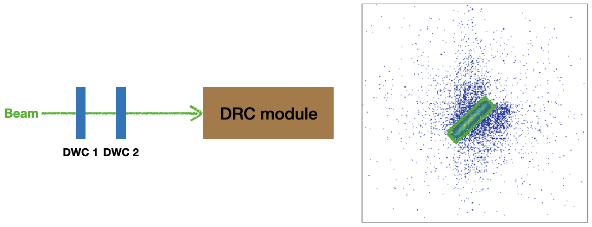
    - On the other hand, beams escaping (tilted too much) out module will reside in the red area of the picture below 
    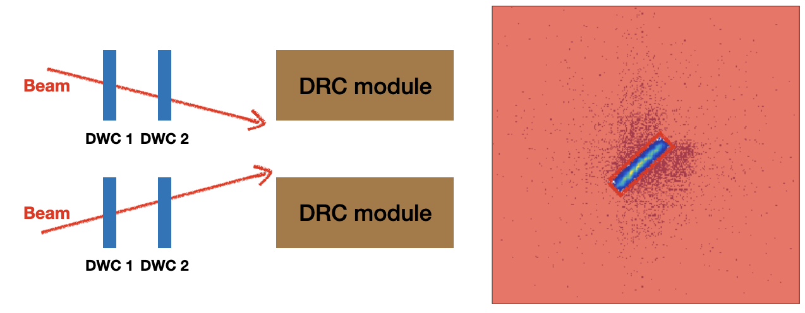
    - Therefore, we'll have to exclude events in the red area of the picture to remove unwanted events
    - One way to give such DWC correlation cut is explained in `TBavgTimeStructure.cc`

- In this exercise, we'll use `TBavgTimeStructure.cc` script in `/dual-readout_TB/analysis`

- Detailed instructions are available in `TBavgTimeStructure.cc` script itself. Please open it and solve the exercise problems.

- After filling all your answers in `TBavgTimeStructure.cc`, compile it and run it to save average time structure root file
    ```sh
    # For example, after finishing exercises in TBavgTimeStructure.cc, to draw average time structures from Run702 ntuple
    bash compile.sh TBavgTimeStructure.cc
    ./TBavgTimeStructure.exe 702 -1
    ```
- This will create average time structure plots and store them in root file at `/dual-readout_TB/analysis/avgTimeStructure/` directory
    
- Created avgTimeStructure root file will contain average time structure of pre-shower and module PMT (C, S channels) like the following
    |    PS avg time structure    |     M1T1S avg time structure      |
    | :-------------------------: | :-------------------------------: |
    | 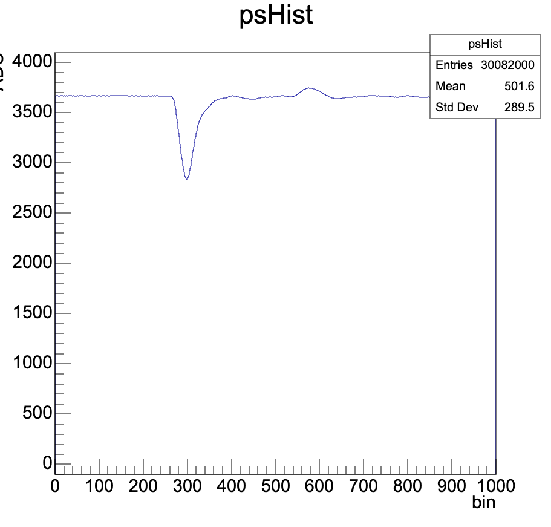 |  |

    - One can decide the integration range of each plot with this average time structure plots
    - Find range that has size enough to cover peak waveform structure
    - For example, we can set 220 ~ 390 bins as our integration range for the pre-shower detector.

- DWC 1 position plot before / after correlation cut (1.5 mm threshold) is also stored in same root file
    |     DWC1 position before cut     |         DWC1 position after cut          |
    | :------------------------------: | :--------------------------------------: |
    | 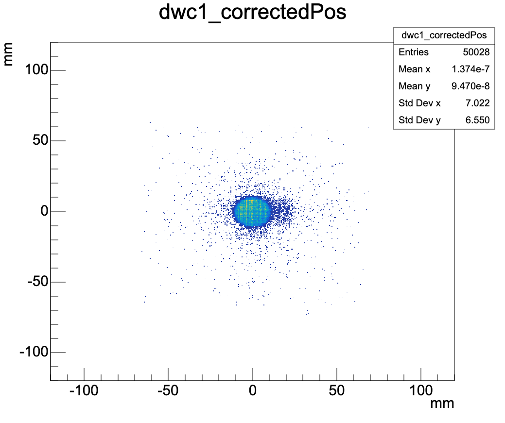 |  |
    
    - One can see that events that are far from DWC 1 centers are almost all excluded by applying correlation cut

#### 5. Draw integrated ADC plot of pre-shower detector, and decide PID cut
- Before starting this exercise
  1. Please make sure DWC root file is created in `/dual-readout_TB/analysis/dwc/` directory
  2. Please create `auxPID/` directory in `/dual-readout_TB/analysis/`
    ```sh
    # In dual-readout_TB/analysis/ directory, create auxPID
    mkdir auxPID
    ```

- In this exercise, students will learn
    - How to get pedestal value of each channels
    - How to get integrated ADC plot of pre-shower detector
    - How to gaussian fit the int. ADC plot to get proper fit result
    - How to get pre-shower PID cut

- How to draw integrated ADC
  - First, we subtract the waveform ADC value from pedestal value
  - For example, if one subtract the pre-shower waveform (blue line) from pedestal (red line), one will get histogram like the right plot
    |     PS waveform and pedestal      |          Pedestal - PS waveform          |
    | :-------------------------------: | :--------------------------------------: |
    | 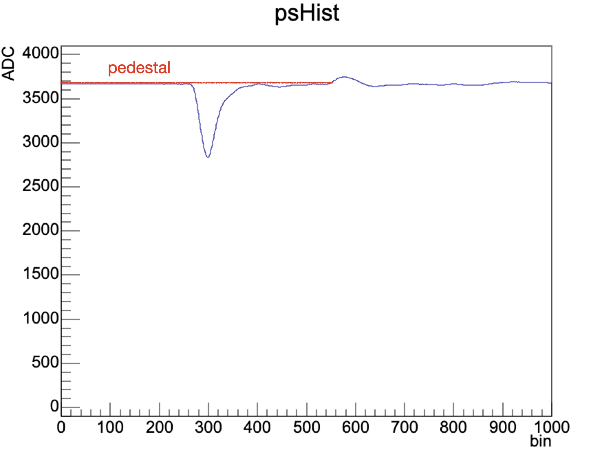 | 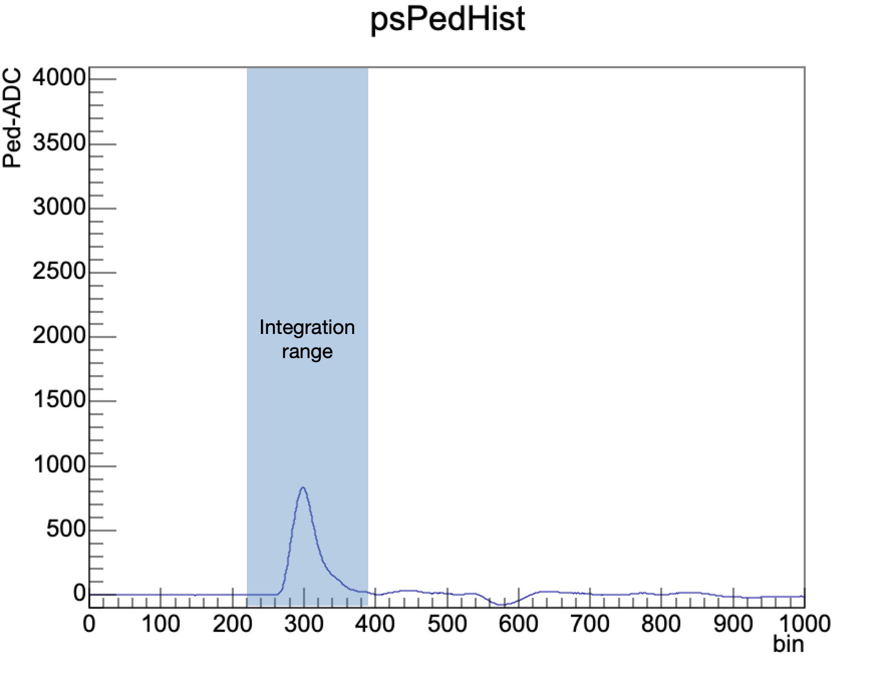 |
  - Here, we sum up (Ped - ADC) values in integration range (blue range in the right plot) to get integrated ADC value

- In this exercise, we'll use `TBauxPID.cc` script in `/dual-readout_TB/analysis`

- Detailed instructions are available in `TBauxPID.cc` script itself. Please open the code and solve exercise problem!

- After filling all your answers in `TBauxPID.cc`, compile it and run it to save root file with pre-shower int. ADC plot
    ```sh
    # For example, after finishing exercises in TBauxPID.cc, to draw integrated ADC plot of pre-shower and gaussian fit function from Run702 ntuple
    bash compile.sh TBauxPID.cc
    ./TBauxPID.exe 702 -1
    ```

- This will create average time structure plots and store them in root file at `/dual-readout_TB/analysis/auxPID/` directory
    

- Created auxPID root file will contain integrated ADC plot of pre-shower detector before and after DWC correlation cut like the following
    | PS int. ADC before DWC cut  |      PS int. ADC after DWC cut      |
    | :-------------------------: | :---------------------------------: |
    | 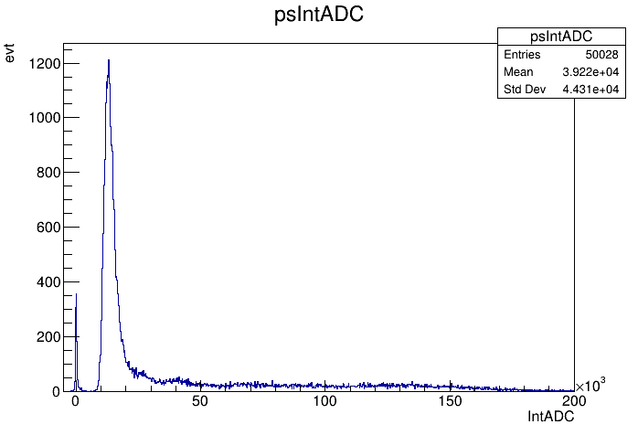 |  |

    - One can see that events at int.ADC ~ 0 (== pedestals) are removed after DWC cut
    - First peak after the pedestal peak is 1-mip peak (peak at ~13000)
    - One need to gaussian fit this 1-mip peak, and use its mean value * 2.5 as pre-shower PID cut
    - Actually, this is not the proper way to set pre-shower PID cut but just preliminary result
    - Detailed description about how to get the proper PID cut will be provided in workshop

- Using default fit range (8000 ~ 18000), 1-mip peak fitting function will look like following
    |          PS 1-mip gaus fit          |           PS 1-mip gaus fit zoomed            |
    | :---------------------------------: | :-------------------------------------------: |
    | 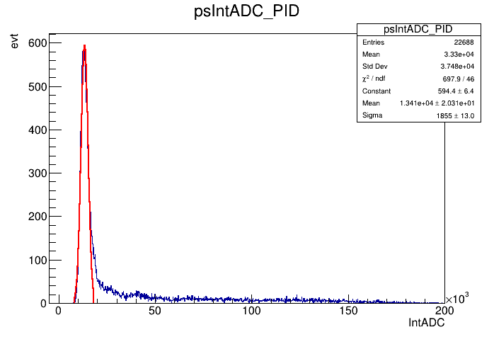 | 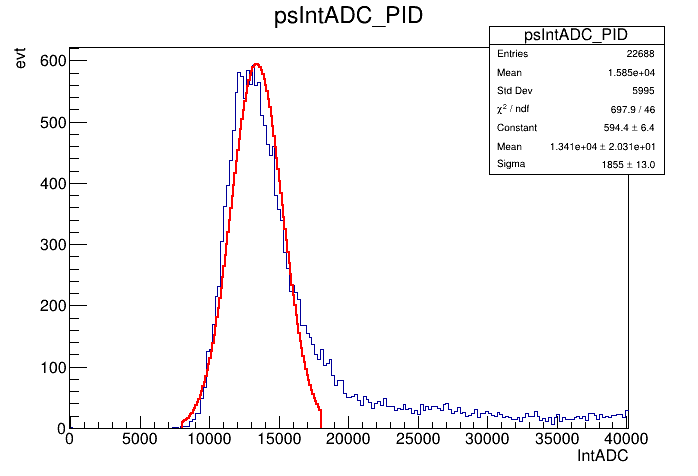 |
    
    - One can see the fitting function (red line) is not well matched with original histogram (blue line)
    - This results in high Chi2/NDF value shown in the stat box (697.9/46 ~ 15)
    - This is due to non-proper fit range
    - For exercise, update the default fit range to more proper range, so that fit result gives better Chi2/NDF value than default result
    ```cpp
    // At line 164 of TBauxPID.cc
    // Change 8000, 18000 into more proper range and check the fit result
    TF1* psFitFunc = new TF1("psFitFunc", "gaus", 8000, 18000);
    ```

#### 6. Draw integrated ADC plot of module PMT
- Before starting this exercise
  1. Please make sure auxPID root file is created in `/dual-readout_TB/analysis/auxPID/` directory
  2. Please create `intADC/` directory in `/dual-readout_TB/analysis/`
    ```sh
    # In dual-readout_TB/analysis/ directory, create intADC
    mkdir intADC
    ```

- In this exercise, students will learn
    - How to give both DWC correlation cut and pre-shower PID cut
    - Draw module integrated ADC plot before and after DWC & PS cut

- In this exercise, we'll use `TBintADC.cc` script in `/dual-readout_TB/analysis`

- Detailed instructions are available in `TBintADC.cc` script itself. Please open the code and solve the exercises!

- After filling all your answers in `TBintADC.cc`, compile it and run it to save root file with int. ADC of modules
    ```sh
    # For example, after finishing exercises in TBintADC.cc, to draw integrated ADC plot of modules from Run702 ntuple
    bash compile.sh TBintADC.cc
    ./TBintADC.exe 702 -1
    ```

- This will create average time structure plots and store them in root file at `/dual-readout_TB/analysis/intADC/` directory
    

- Created intADC root file will contain integrated ADC plot of PS and DRC module before / after DWC & PS cut like the following
    |  M1T1 C int. ADC before cut   |       M1T1 C int. ADC after cut       |
    | :---------------------------: | :-----------------------------------: |
    | 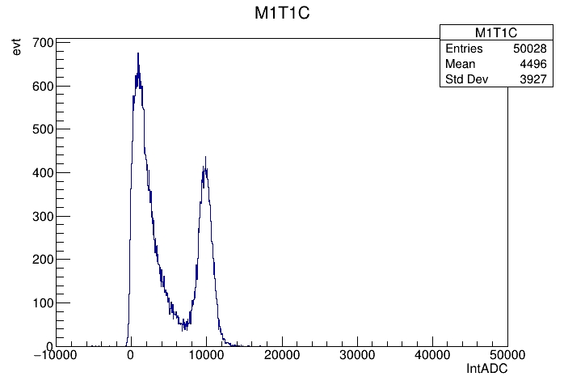 | 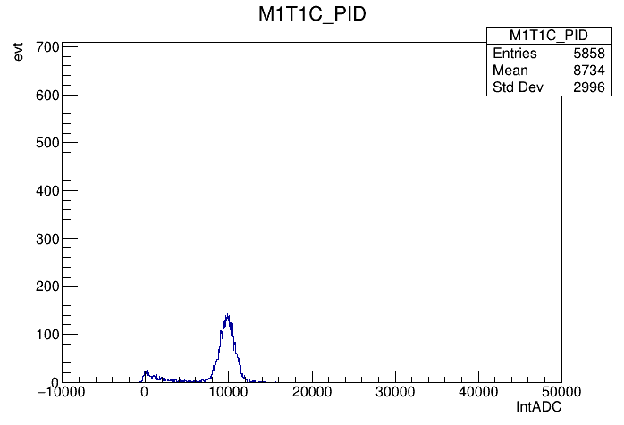 |

  - One can see that the events at 0 (pedestal peak) are removed after DWC & PS cut
  - One can see that efficiency of Run 702 is ~ 12% (5858 evt out of 50028 evt survived)

---
## 4) Running on batch scheduler (HTcondor)
```shell
[swkim@idream]$ # Sample script for running TBdrawWave.exe is in dual-readout_TB/condor_script/
[swkim@idream]$ cd condor_script
[swkim@idream]$ ls
exe_condor.sh  sub_condor.sub
```
#### 1. Write HTcondor submission script : sub_condor.sub
Sample submission script to run `TBdrawWave.exe` on batch scheduler
This script will run `exe_condor.sh $(Run_number)`, where `$(Run_number)` is line read from the `run_list_m1.txt` file
```sh
# sub_condor.sub
universe = vanilla
executable = exe_condor.sh # This submission script will execute exe_condor.sh script. Change to your own executable script.

arguments = $(Run_number) # Use run number as 1st argument to be passed to exe_condor.sh

# Fix here to locate logs in appropriate directory
output = ./drawWave_log/out/o_$(Run_number).out # output log file location
error  = ./drawWave_log/err/e_$(Run_number).err # error  log file location
log    = ./drawWave_log/log/l_$(Run_number).log # condor log file location

request_memory = 1 GB # 1 GB will be enough for most of jobs

should_transfer_files = YES
when_to_transfer_output = ON_EXIT
# Fix here to properly locate & transfer your executable to be executed by exe_condor.sh, lib64 folder and exe_condor.sh script
transfer_input_files = /u/user/swkim/pre-exercise/dual-readout_TB/analysis/TBdrawWave.exe, \
                       /u/user/swkim/pre-exercise/dual-readout_TB/install/lib64, \
                       /u/user/swkim/pre-exercise/dual-readout_TB/exe_condor.sh

JobBatchName = draw_wave_m1 # Job name
queue Run_number from run_list_m1.txt # Read run_list_m1.txt line by line, and use them as $(Run_number)
# Note that run_list_m1.txt should be in the same directory as your condor submission script
```
#### 2. Write HTcondor execution script : exe_condor.sh
The `sub_condor.sub` script will run `exe_condor.sh`
`exe_condor.sh` will set environment variables on HTcondor, and run `TBdrawWave.exe`
```sh
# exe_condor.sh
#! /bin/bash

source /cvmfs/sft.cern.ch/lcg/views/LCG_102/x86_64-centos7-gcc11-opt/setup.sh

export LD_PRELOAD="/usr/lib64/libpdcap.so"
export LD_LIBRARY_PATH="$LD_LIBRARY_PATH:/usr/lib64/dcap"

# Fix here to your own installation directory!!
export INSTALL_DIR_PATH=/u/user/swkim/pre-exercise/dual-readout_TB/install # FIX!!

export LD_LIBRARY_PATH=$LD_LIBRARY_PATH:$INSTALL_DIR_PATH/lib64
export PYTHONPATH=$PYTHONPATH:$INSTALL_DIR_PATH/lib64

# This script will run TBdrawWave.exe with arguments $1, 100
# $1 : First argument passed to exe_condor.sh by sub_condor.sub. In this case, it is $(Run_number)
# 100 : Maximum number of events to process
# Change TBdrawWave.exe to any other executable to run on batch
./TBdrawWave.exe $1 100
```

#### 3. Submit condor batch jobs using condor_submit
```sh
# In directory with sub_condor.sub, exe_condor.sh, run_list_m1.txt and proper log files
condor_submit sub_condor.sub

# Using condor_q, one can check their batch job status
condor_q
```

>__Note__ For more information about running HTcondor, please refer to [this manual](http://t2-cms.knu.ac.kr/wiki/index.php/HTCondor)

>__Note__ Data stored in KNU Tier-3 Storage Element can also be browsed on batch jobs using dcap protocal. For more information about dcap, please refer to [this manual](http://t2-cms.knu.ac.kr/wiki/index.php/Dcap)

---
## 5) Troubleshooting
#### Exercise script compile error
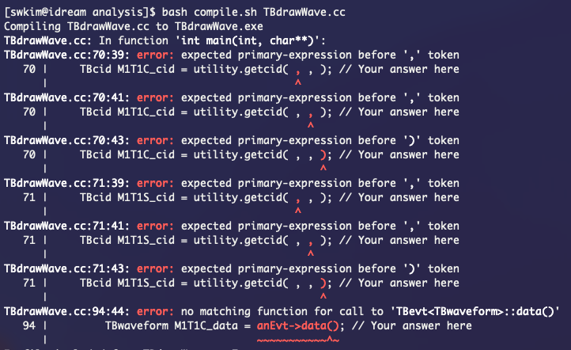
- One need to solve all the exercises before compiling it!
- Open the exercise code, find lines with `// Your answer here` and fill in the blanks

#### g++ error while compiling anaylsis scripts 

- Make sure that you set environment variable everytime you access to the server
- Also, source envset.sh should be done on dual-readout_TB directory
```shell
[swkim@idream]$ pwd # Make sure you're in dual-readout_TB directory
/u/user/swkim/dual-readout_TB/
[swkim@idream]$ source envset.sh
```

#### Library error while running executable (same solution as above)


- Make sure that you set environment variable everytime you access to the server
- Also, source envset.sh should be done on dual-readout_TB directory
```shell
[swkim@idream]$ pwd # Make sure you're in dual-readout_TB directory
/u/user/swkim/dual-readout_TB/
[swkim@idream]$ source envset.sh
```

#### Environment setup

```sh
export LD_LIBRARY_PATH=$LD_LIBRARY_PATH:<path_to_install>/lib64 # or lib based on your architecture
export PYTHONPATH=$PYTHONPATH:<path_to_install>/lib64 # or lib based on your architecture
```

---
## 6) Useful links
[2023 DRC workshop @GWNU indico](https://indico.cern.ch/event/1238214/timetable/?view=standard)\
[2022 TB @ CERN main documentation page](https://docs.google.com/document/d/13-dYgLaBQg3d9drPBWCKbW1INf3dPyZcV-TeA5QGHj0/edit#)\
[Run list](https://docs.google.com/spreadsheets/d/10W4B2Zf2D27pCLkIICKF_VY2HcQZOb1e/edit?usp=sharing&ouid=117548372861877042914&rtpof=true&sd=true)\
[DAQ log](https://docs.google.com/spreadsheets/d/1Cfoetfduc2Tb8mBhA6O9rtuxci5SGBaZw9uualKWfUA/edit#gid=262558796)\
[Mapping info](https://docs.google.com/spreadsheets/d/1ZFLbl-4OOqhWQlKlCitL4Pl__JsoVFMME0hQWy3N-M8/edit#gid=257337700)\
[DWC info](https://twiki.cern.ch/twiki/pub/DREAM/DwcCalibration/DWC_calibration.pdf)\
[KNU Tier-3 HTcondor manual](http://t2-cms.knu.ac.kr/wiki/index.php/HTCondor)\
[Using dcap](http://t2-cms.knu.ac.kr/wiki/index.php/Dcap)